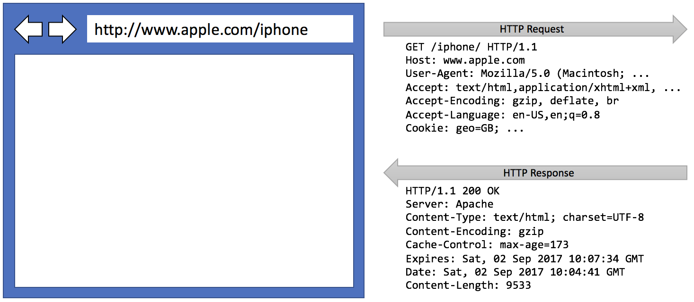
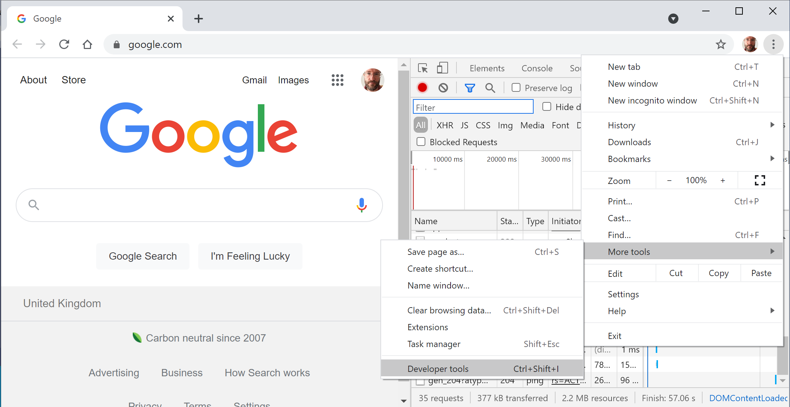
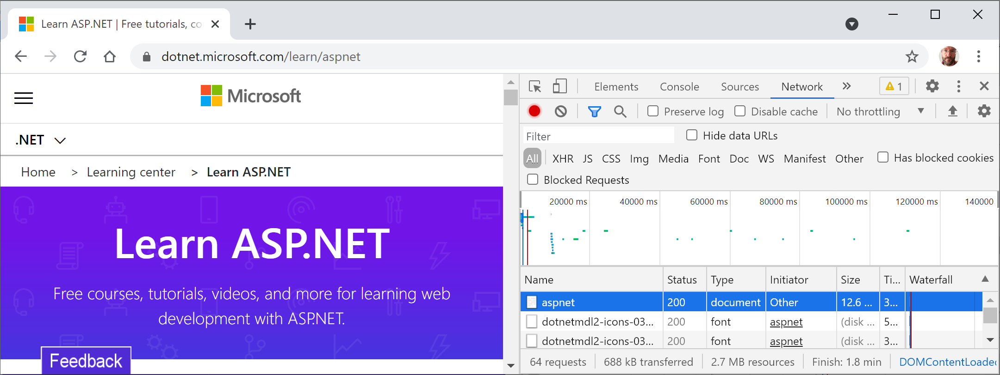
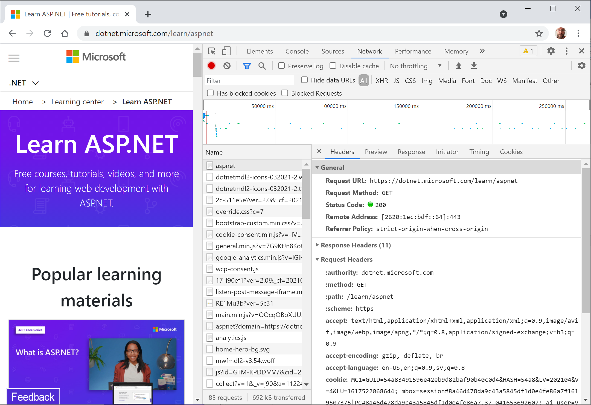

**Understanding web development**

Developing for the web means developing with the **Hypertext Transfer Protocol (HTTP)**, so we will start by reviewing this important foundational technology.

# Understanding the Hypertext Transfer Protocol

To communicate with a web server, the client, also known as the **user agent**, makes calls over the network using HTTP. As such, HTTP is the technical underpinning of the web. So, when we talk about websites and web services, we mean that they use HTTP to communicate between a client (often a web browser) and a server.

A client makes an HTTP request for a resource, such as a page, uniquely identified by a Uniform Resource Locator (URL), and the server sends back an HTTP response, as shown in *Figure 1A.1*:

*Figure 1A.1: An HTTP request and response*

You can use Google Chrome and other browsers to record requests and responses.

> **Good Practice**: Google Chrome is currently used by about two-thirds of website visitors worldwide, and it has powerful, built-in developer tools, so it is a good first choice for testing your websites. Test your websites with Chrome and at least two other browsers, for example, Firefox and Safari for macOS and iPhone. Microsoft Edge switched from using Microsoft's own rendering engine to using Chromium in 2019, so it is less important to test with it, although some say Edge has the best developer tools. If Microsoft's Internet Explorer is used at all, it tends to mostly be inside organizations for intranets.

# Understanding the components of a URL

A URL is made up of several components:
- **Scheme**: `http` (sent as clear text) or `https` (encrypted).
- **Domain**: For a production website or service, the **top-level domain (TLD)** might be example.com. You might have subdomains such as `www`, `jobs`, or `extranet`. During development, you typically use `localhost` or `127.0.0.1` for all websites and services.
- **Port number**: For a production website or service, `80` for `http`, `443` for `https`. These port numbers are usually inferred from the scheme so they do not need to be explicitly specified. During development, other port numbers are commonly used, such as `5000`, `5001`, and so on, to differentiate between websites and services that all use the shared domain `localhost`.
- **Path**: A relative path to a resource, for example, `/customers/germany`.
- **Query string**: A way to pass parameter values, for example, `?country=Germany&searchtext=shoes`.
- **Fragment**: A reference to an element on a web page using its id, for example, `#toc`, to reference the following element: `
...
`.

A URL is a subset of a **Uniform Resource Identifier (URI)**. A URL specifies where a resource is located and how to get it. A URI identifies a resource either by URL or **URN (Uniform Resource Name)**.

# Using Google Chrome to make HTTP requests

Let's explore how to use Google Chrome to make HTTP requests:
1.	Start **Google Chrome**.
2.	Navigate to **More tools** | **Developer tools**.
3.	Click the **Network** tab, and Chrome should immediately start recording the network traffic between your browser and any web servers (note the red circle), as shown in *Figure 1A.2*:

 
*Figure 1A.2: Chrome Developer tools recording network traffic*

4.	In Chrome's address box, enter the address of Microsoft's website for learning ASP.NET, as shown in the following URL:
https://dotnet.microsoft.com/en-us/learn/aspnet
5.	In **Developer Tools**, in the list of recorded requests, scroll to the top and click on the first entry, the row where the **Type** is **document**, as shown in *Figure 1A.3*:

 
*Figure 1A.3: Recorded requests in Developer Tools*

6.	On the right-hand side, click on the **Headers** tab, and you will see details about **Request Headers** and **Response Headers**, as shown in *Figure 1A.4*:

*Figure 1A.4: Request and response headers*

Note the following aspects:
- **Request Method** is `GET`. Other HTTP methods that you could see here include `POST`, `PUT`, `DELETE`, `HEAD`, and `PATCH`.
- **Status Code** is `200` OK. This means that the server found the resource that the browser requested and has returned it in the body of the response. Other status codes that you might see in response to a `GET` request include `301` Moved Permanently, `400` Bad Request, `401` Unauthorized, and `404` Not Found.
- **Request Headers** sent by the browser to the web server include:
  - **accept**, which lists what formats the browser accepts. In this case, the browser is saying it understands HTML, XHTML, XML, and some image formats, but it will accept all other files (`*/*`). Default weightings, also known as quality values, are `1.0`. XML is specified with a quality value of `0.9` so it is preferred less than HTML or XHTML. All other file types are given a quality value of `0.8` so are least preferred.
  - **accept-encoding**, which lists what compression algorithms the browser understands, in this case, GZIP, DEFLATE, and Brotli.
  - **accept-language**, which lists the human languages it would prefer the content to use. In this case, US English, which has a default quality value of `1.0`, then any dialect of English, which has an explicitly specified quality value of `0.9`, and then any dialect of Swedish, which has an explicitly specified quality value of `0.8`.
- **Response Headers**, **content-encoding**, which tells me the server has sent back the HTML web page response compressed using the GZIP algorithm because it knows that the client can decompress that format. (This is not visible in *Figure 1A.4* because there is not enough space to expand the Response Headers section.)

7.	Close Chrome.

# Understanding client-side web development technologies

When building websites, a developer needs to know more than just C# and .NET. On the client (that is, in the web browser), you will use a combination of the following technologies:
- **HTML5**: This is used for the content and structure of a web page.
- **CSS3**: This is used for the styles applied to elements on the web page.
- **JavaScript**: This is used to code any business logic needed on the web page, for example, validating form input or making calls to a web service to fetch more data needed by the web page.

Although HTML5, CSS3, and JavaScript are the fundamental components of frontend web development, there are many additional technologies that can make frontend web development more productive, including:
- **Bootstrap**: the world's most popular frontend open-source toolkit.
- **SASS** and **LESS**: CSS preprocessors for styling.
- **TypeScript**: Microsoft's language for writing more robust code.
- JavaScript libraries such as **Angular**, **jQuery**, **React**, and **Vue**.

All these higher-level technologies ultimately translate or compile to the underlying three core technologies, so they work across all modern browsers.
As part of the build and deploy process, you will likely use technologies such as:
- **Node.js**: a framework for server-side development using JavaScript.
- **Node Package Manager (npm)** and **Yarn**: both client-side package managers.
- **Webpack**: a popular module bundler, and a tool for compiling, transforming, and bundling website source files.
